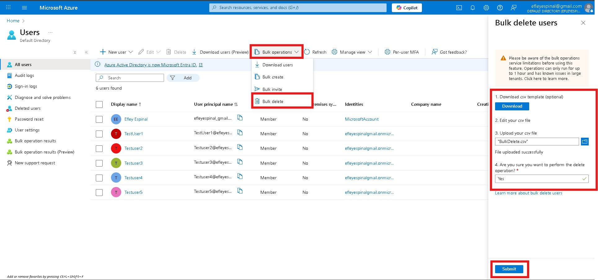

## Bulk Adding New User Account

#In this Project, i am Bulk adding user accounts. User account will have User Principal Name ( User email), Display Name, First Name, Last Name, Job Title, Department, Account enabled, Usage Location, Street Address, State, Country, City, Phone Number

1. Sign into **Azures portal** - `https://portal.azure.com`.

1. Search for and select `Microsoft Entra ID`. Microsoft Entra ID is Azure's cloud-based identity and access management solution. 

## Azure Portal/Entra

1. Select the **User** blade 

## Microsoft Entra User Blade

2. Go to **Bulk Operations**  and then select **Bulk Create** or **Bulk Invite**

3. A Side Panel pops up and you can **Download Template Csv** and edit the list with the required information

### Bulk Added Users Operation

### Bulk Added Users CSV

4. **Attach** the updated CSV and **Submit**

   > Notice this operation may take up to one our and may fail if csv is uploaded incorrectly. If failed check bulk operation results. 

5. Confirm Bulk List of Users Added

### Confirming Bulk Added Users

   
### Bulk Deleting Users

1. Go to Azure Portal/Entra

1. Select the **User** blade 

### Microsoft Entra User Blade

2. Go to **Bulk Operations**  and then select **Bulk Delete** 

3. A Side Panel pops up and you can **Download Template Csv** and edit the list with the required information
 
### Bulk Delete Operation

### Bulk Delete User List CSV

4. **Attach** the updated CSV and **Submit**
   > Notice this template is different from bulk adding users. This operation may take up to one our and may fail if csv is uploaded incorrectly. If failed check bulk operation results. 

5. Confirm Bulk List of Users Removed

### Confirmed Removed Users

